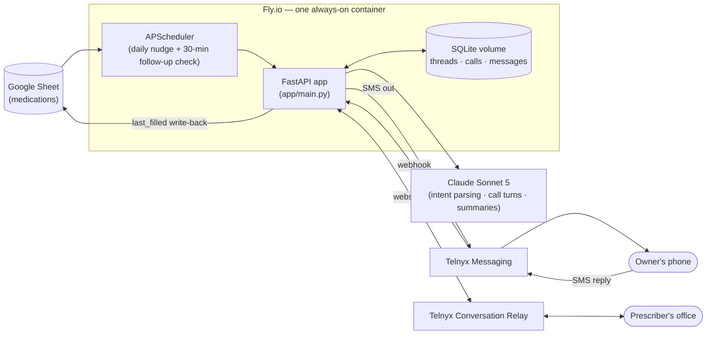
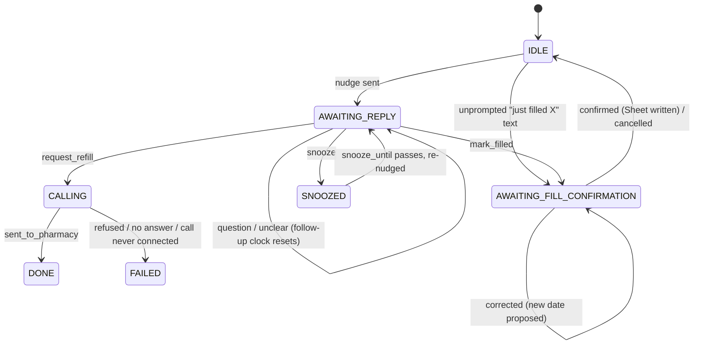

[README](README.md) · [Architecture](ARCHITECTURE.md) · [Workflow](WORKFLOW.md) · [Plan](PLAN.md) · [CLAUDE.md](CLAUDE.md)

# Architecture

Technical reference for how automaterx is put together today. For the *why* behind these
choices (vendor picks, security tradeoffs, milestone sequencing), see [PLAN.md](PLAN.md). For
what actually happens step by step when a nudge goes out or a reply comes in, see
[WORKFLOW.md](WORKFLOW.md).

## System overview

One process. The reasons it's a single always-on container rather than serverless functions:
the voice component holds a persistent websocket (`/voice/relay`) for the life of a call, and
the in-process APScheduler jobs need to keep running between requests. See PLAN.md §2 for the
original rationale — nothing since then has changed it.

## Components

| File | Responsibility |
|---|---|
| `app/main.py` | FastAPI app: `/sms/inbound`, `/voice/relay` (websocket), `/voice/status`, `/health`; owns the APScheduler instance and both its jobs |
| `app/nudge.py` | Daily job — finds medications due for a refill and sends the first nudge |
| `app/followup.py` | Periodic job (every 30 min) — sends randomized follow-up texts for nudges that went unanswered, within a configurable daily window, up to a day cap |
| `app/reply.py` | Inbound SMS orchestration — resolves which medication a reply is about, dispatches to the decision classifier or the fill-confirmation classifier, mutates thread state, builds the reply text |
| `app/intent.py` | All Claude calls that classify free text into a structured intent (forced tool-use): reply intent (`request_refill`/`snooze`/`mark_filled`/`question`/`unclear`) and fill-confirmation intent (`confirmed`/`corrected`/`cancelled`/`unclear`) |
| `app/voice.py` | M2 voice: places the call, the fact sheet + system prompt for in-call turns, the AMD/voicemail branch, transcript summarization |
| `app/sheet.py` | Google Sheet boundary — `parse_records` (pure, testable) validates raw rows into `Medication`; `load_medications`/`mark_filled` are the live `gspread` calls |
| `app/models.py` | SQLite access: the `Thread`/`Medication` models, the thread state-machine transition functions, message logging |
| `app/sms.py` | Telnyx SMS send |
| `app/db.py` | SQLite schema (`CREATE TABLE IF NOT EXISTS` + an `ALTER TABLE` migration step for columns added after a DB already existed) |
| `app/config.py` | `Settings` — the single source of truth for required env vars; fails fast at startup if one's missing |

## Data stores

### Google Sheet — one row per medication

Read-only except for a `last_filled` write-back (either from a confirmed pharmacy call or a
confirmed text-in fill). Columns: `med`, `dose`, `qty`, `days_supply`, `last_filled`,
`prescriber`, `prescriber_phone`, `phone_tree_hint`, `lead_days`, `status`, `notes`.

`runs_out = last_filled + days_supply`; the nudge fires at `runs_out - lead_days`
(`app/models.py: Medication.is_due`).

### SQLite (`threads` table — one row per `med_key`)

| Column | Purpose |
|---|---|
| `med_key` | Primary key — a slug of `med + dose` (`slugify`), not a Sheet row number, since row numbers shift when the Sheet is edited |
| `state` | See the state machine below |
| `snooze_until` | Set by a `snooze` reply |
| `last_nudged_at` | Timestamp of the most recent nudge or follow-up sent |
| `first_nudged_at` | Timestamp of the *original* nudge — the anchor the follow-up day-cap counts from, not reset by later follow-ups |
| `next_followup_at` | When the next follow-up is eligible to fire |
| `followup_final_sent` | Set once the day-cap final message has gone out, so it isn't repeated |
| `pending_fill_date` | The date proposed by a `mark_filled` intent, awaiting confirm/correct/cancel |

Plus `calls` (one row per placed call: `med_key`, `provider_call_sid`, timestamps, `outcome`,
`transcript`, `summary`) and `messages` (every inbound/outbound SMS body, for context and
debugging).

### Thread state machine

A `question` or `unclear` reply never changes state — you can ask something mid-thread without
losing the pending decision, though see [WORKFLOW.md](WORKFLOW.md) for how that still affects
the follow-up schedule.

## Security

- **Webhook signature verification** — Telnyx signs `/sms/inbound` and `/voice/status` the same
  way (Ed25519); `_verify_telnyx_webhook` in `app/main.py` covers both.
- **Single-number allowlist** — an inbound SMS whose sender isn't exactly `OWNER_PHONE` gets a
  bare `200` and nothing else; no confirmation that the number is live.
- **Signed one-time token on `/voice/relay`** — Conversation Relay doesn't authenticate the
  websocket itself, so `app/voice.py: sign_relay_token`/`verify_relay_token` binds it to a
  locally-minted `rid` + `med_key` (not `call_control_id`, which Telnyx doesn't hand back until
  *after* `dial()` is called, too late to build the URL).
- **Identity data lives only in env config** (`Settings.patient_name`, `patient_dob`,
  `pharmacy_*`) — never the Sheet, so sharing or losing control of the Sheet doesn't expose DOB.
- **Claude is fact-gated** — both `app/intent.py` and `app/voice.py` build their system prompts
  from a closed set of facts (the one `Medication`'s fields, or the voice call's fact sheet) and
  explicitly instruct the model to refuse rather than invent anything outside it.
- **A hard cap on outbound calls per day** (`MAX_CALLS_PER_DAY`) so a bug can't dial a
  prescriber's office repeatedly.

## Deployment

`Dockerfile` does a `uv`-based build on `python:3.12-slim`. `fly.toml` targets Fly.io with:

- `min_machines_running = 1` / `auto_stop_machines = false` — this process owns the
  APScheduler jobs and live call websockets, so it can never be scaled to zero between
  requests without silently dropping nudges and follow-ups.
- A mounted volume at `/data` holding the SQLite file, so state survives deploys.
- `docker-entrypoint.sh` decodes `google-service-account.json` from a base64'd Fly secret on
  boot, since that file is gitignored and Fly secrets only hold env vars, not files.
