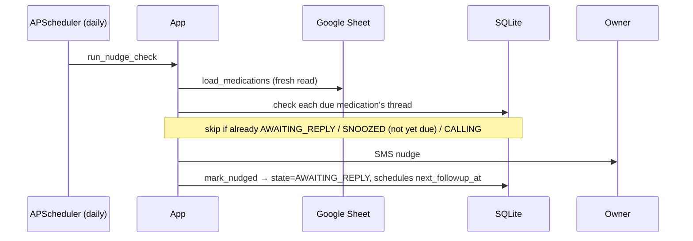
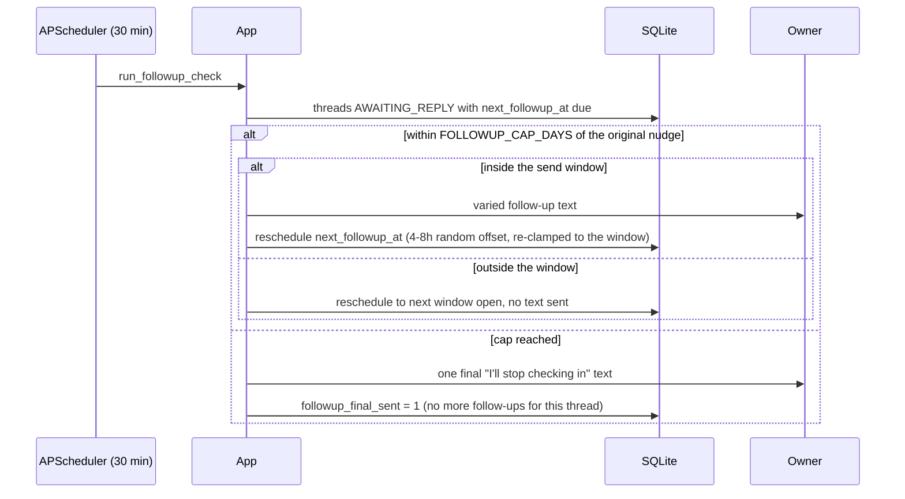
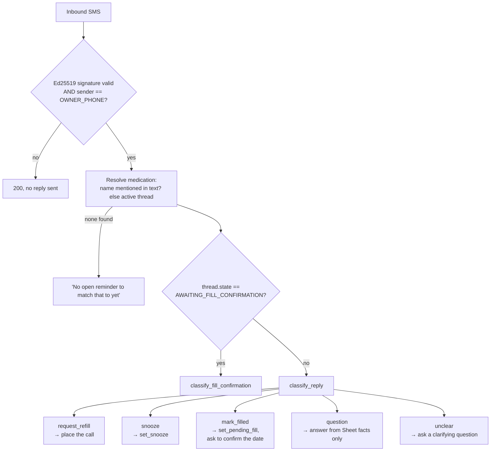
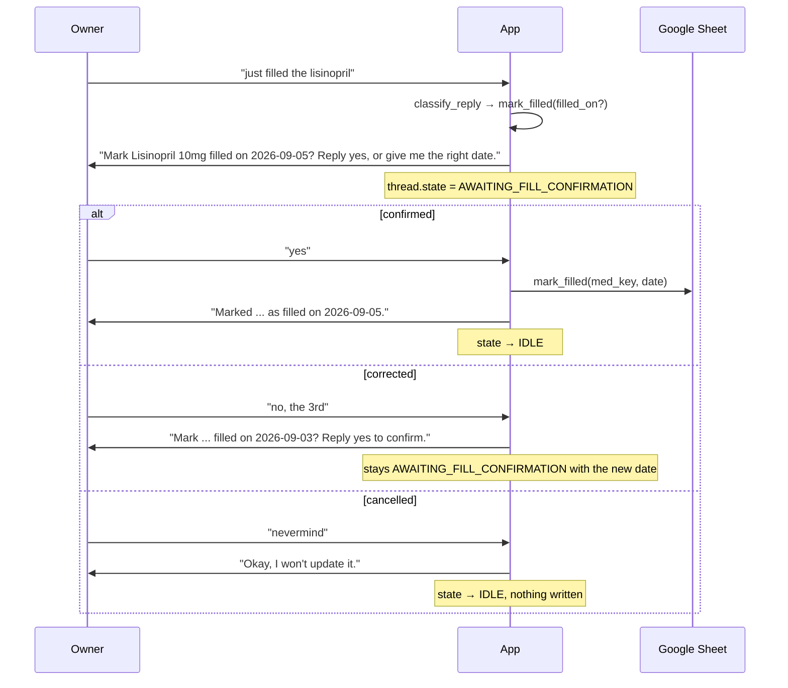
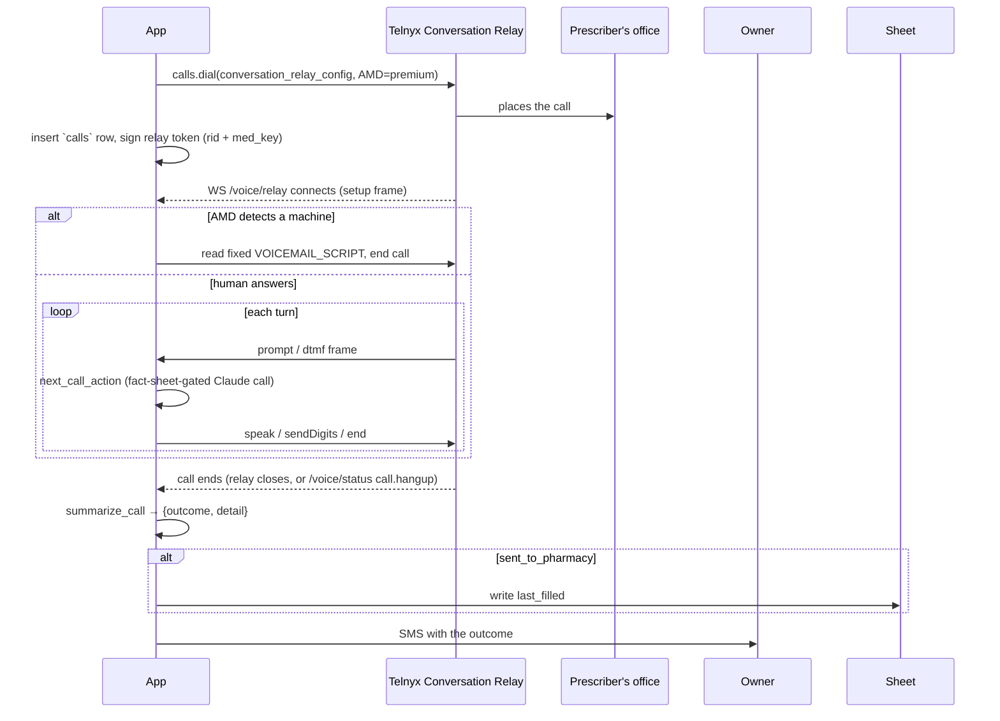

[README](README.md) · [Architecture](ARCHITECTURE.md) · [Workflow](WORKFLOW.md) · [Plan](PLAN.md) · [CLAUDE.md](CLAUDE.md)

# Workflow

Step-by-step walkthroughs of what actually happens for each thing this app does. For the
component map and data model these workflows move through, see
[ARCHITECTURE.md](ARCHITECTURE.md).

## 1. Nudge → follow-up

If nothing comes back, a second scheduler job (`run_followup_check`, every 30 minutes) picks up
where the nudge left off:

The day-cap counts from `first_nudged_at` — the *original* nudge — not from the last follow-up,
so it can't be reset indefinitely by repeated follow-ups.

## 2. Reply → classify → act

Every inbound SMS goes through the same entry point (`app/reply.py:
handle_inbound_reply`), regardless of which of the branches below it ends up in.

Medication resolution tries a **name match** first (so an unprompted text like "just filled the
lisinopril" works with no open thread), and only falls back to `get_active_thread` — the thread
`AWAITING_REPLY`/`AWAITING_FILL_CONFIRMATION`, or else whichever was touched most recently — when
the text doesn't name exactly one medication.

A `question` or `unclear` reply while `AWAITING_REPLY` doesn't change state, but it does push
the follow-up clock forward from that moment — the owner engaged, so the next automated
follow-up shouldn't fire as if they'd gone silent.

## 3. Confirming a fill date

`mark_filled` never writes to the Sheet on the first message — it always proposes a date and
waits for a second reply:

This is the one place a misclassification can't silently corrupt the Sheet — nothing is written
until the owner explicitly confirms a specific date.

## 4. Refill call (M2)

Only reachable via a `request_refill` reply — the system never dials on its own initiative.

The agent's system prompt is built from a **closed fact sheet** (patient name/DOB, this one
medication, prescriber, pharmacy) with an explicit instruction to say "I don't have that, I'll
have him call you back" rather than improvise anything outside it — the same fact-gating
principle `classify_reply` uses for text replies. One attempt, no auto-retry: if it fails, the
owner finds out within minutes and can just say "try again."
